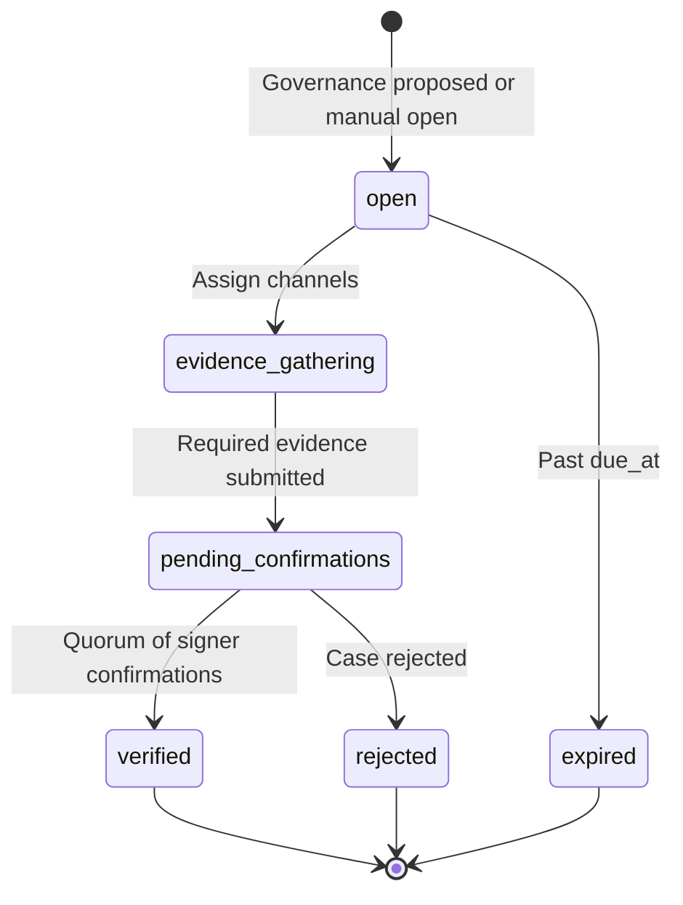

# SEAL Phase 3 — Operational Workflows (Implementation Plan)

This document is the detailed implementation plan for Phase 3 of Convixa's [SEAL-aligned governance](SEAL_COMPLIANCE.md) roadmap.

| Phase | Question answered |
|-------|-------------------|
| Phase 1 | Is this Safe configured correctly? Did configuration change? |
| Phase 2 | Who operates each signer key? Are they verified for this Safe? |
| **Phase 3** | **Are we following correct procedures before signing? Are admin changes verified out-of-band? How do we report and track incidents?** |

Reference: [SEAL Secure Multisig Best Practices](https://frameworks.securityalliance.org/wallet-security/secure-multisig-best-practices/) — especially *Independent Transaction Verification*, *Out-of-Band Verification for Admin Changes*, *Communication & Documentation* (incident reporting), and *General Signing Guidelines*.

**Prerequisite:** [Phase 2 plan](SEAL_COMPLIANCE_PHASE2.md) shipped (signer roster, affiliation verification, EOA activity v1).

---

## Executive summary

Phase 3 turns Convixa from a **monitoring and accountability** product into an **operational workflow** product — without crossing the read-only boundary. Users still sign in Safe App; Convixa structures the human process around signing and critical admin changes.

### Measurable goals (definition of done)

1. **Pre-sign checklist** — Every pending multisig transaction on treasury/protocol safes can display a SEAL-aligned verification checklist with automated + manual items; signers record completion before opening Safe App.
2. **Signing coordination** — Signers can post structured review status on a pending tx (`checked`, `signed`, confirmations remaining) visible to other org members.
3. **OOB verification cases** — Critical governance proposals (signer add/remove, threshold decrease, guard/module change) open a trackable case requiring multi-channel confirmation before the org considers the change "verified."
4. **Incident reporting** — Org members and signers can file structured security incidents (key compromise, key loss, suspicious activity) with audit trail and admin notification.
5. **SEAL compliance rules** — Phase 3 rules surface checklist coverage, open OOB cases, and overdue verifications on the scorecard.
6. **Alerts** — New alert types fire when high-risk pending txs lack reviews, OOB cases are overdue, or incidents are reported.

### Read-only boundary (unchanged)

Convixa does **not**:

- Sign or execute multisig transactions
- Block signing in Safe App (policy engine "block" actions remain advisory labels for export/reporting unless product scope changes)
- Replace video calls or external comms tools — it **documents** that they occurred

Convixa **does**:

- Present checklists and capture attestations
- Track OOB verification evidence and signer confirmations
- Intake incidents and notify responsible parties

---

## SEAL guidance → Phase 3 features

| SEAL guidance | Convixa Phase 3 deliverable |
|---------------|----------------------------|
| *Independent Transaction Verification* — verify raw tx data before signing | Pre-sign checklist with decoded calldata summary + automated policy checks |
| *General Signing Guidelines* — "how to check" guide; communicate status after signing | Checklist templates + signer review comments on pending txs |
| *Out-of-Band Verification for Admin Changes* — video call + signed message via multiple channels | OOB verification case workflow tied to governance proposals |
| *Incident Reporting* — notify participants and security contact on key loss/compromise | Structured incident intake + notifications |
| *Documented Procedures* — transaction creation, signing, emergency recovery | Checklist templates + OOB case export for audit packs |

---

## What Phase 1 & 2 provide (foundation)

| Asset | Location | Phase 3 extension |
|-------|----------|-------------------|
| Pending tx feed | Safe API, poller, signer queue | Attach checklist + reviews per `safeTxHash` |
| Tx classification | `src/lib/alerting/classifier.ts`, `inferTxType` | Drive checklist item selection |
| Policy engine | `src/lib/policy-engine/` | Auto-evaluate checklist items (allowlist, amount, new counterparty) |
| Address lists | `address_lists`, org blacklist | Checklist items: destination in/out of list |
| Transaction history | `safe_transaction_history` | "New counterparty" automated check |
| Config events | `safe_config_events`, `normalizedEvents` | Open OOB cases on governance proposals |
| Signer roster | `safe_signer_roster` | OOB case assignees; incident links to signers |
| Affiliation proofs | `signer_affiliation_proofs` | Reference in OOB "signed message" channel |
| Signer queue UI | `/dashboard/signer-queue` | Embed checklist + review actions |
| Security hub | `/dashboard/security/*` | OOB cases board + incident log |
| Alerts / policies | `alert_rules`, policy templates | Phase 3 alert types + SEAL templates |
| Audit logs | `audit_logs` | Incident + OOB lifecycle events |

**Current gap:** Pending txs are visible but unstructured. Governance proposals trigger alerts but have no workflow for multi-channel verification. There is no incident intake path aligned with SEAL communication guidance.

---

## Architecture

```
┌──────────────────────────────────────────────────────────────────────────┐
│                           DATA INPUTS                                     │
│  Safe pending txs │ normalizedEvents │ safe_config_events │ roster       │
│  address_lists │ transaction_history │ policy engine │ rates (USD)       │
└────────────────────────────────┬─────────────────────────────────────────┘
                                 │
       ┌─────────────────────────┼─────────────────────────┐
       ▼                         ▼                         ▼
┌──────────────┐        ┌─────────────────┐      ┌──────────────────┐
│ Checklist    │        │ OOB verification │      │ Incident         │
│ engine       │        │ cases            │      │ intake           │
│ (auto+manual)│        │ (multi-channel)  │      │ + notifications  │
└──────┬───────┘        └────────┬─────────┘      └────────┬─────────┘
       │                         │                         │
       └─────────────────────────┼─────────────────────────┘
                                 ▼
                    ┌────────────────────────┐
                    │ seal-compliance        │
                    │ Phase 3 rules          │
                    └────────────┬───────────┘
                                 ▼
              ┌──────────────────────────────────────┐
              │ Signer queue, safe detail, security   │
              │ hub, alerts, exports, audit           │
              └──────────────────────────────────────┘
```

---

## Deliverable 3.1 — Checklist templates & engine

### Concept

A **checklist template** defines ordered items for a given context (safe classification + tx type). Items are either:

- **Automated** — evaluated by Convixa (policy conditions, list membership, decoded params)
- **Manual** — signer attests via checkbox + optional note

Templates are org-configurable with SEAL defaults.

### Table: `checklist_templates`

| Column | Type | Notes |
|--------|------|-------|
| `id` | uuid PK | |
| `org_id` | uuid FK | |
| `name` | text | e.g. "Treasury outbound transfer" |
| `classification` | text nullable | `treasury`, `protocol_critical`, or null = all |
| `tx_categories` | json | `["ETH_TRANSFER","ERC20_TRANSFER","GOVERNANCE",...]` |
| `items_json` | json | Array of `{ id, label, type: auto\|manual, autoRule?, required }` |
| `is_default` | boolean | SEAL seed templates |
| `created_at`, `updated_at` | timestamp | |

### Default SEAL template items (seed data)

| Item ID | Type | Label | Auto rule (if applicable) |
|---------|------|-------|---------------------------|
| `decode_reviewed` | manual | I reviewed decoded target, function, and parameters | — |
| `destination_known` | auto | Destination is on org allowlist or prior counterparties | `counterparty_in_list` or history lookback |
| `not_blacklisted` | auto | Destination not on org blacklist | `counterparty_in_list` deny mode |
| `amount_within_policy` | auto | Transfer amount within configured USD limit | `amount_usd_greater_than` inverted |
| `new_counterparty_ack` | manual | I acknowledge this is a new counterparty and approve | fires when `new_counterparty` true |
| `internal_approval_ref` | manual | Internal approval reference documented (ticket/link) | required for treasury+ |
| `hardware_wallet_used` | manual | I am signing from a hardware wallet | — |
| `safe_app_match` | manual | Safe App preview matches this checklist summary | — |

### Module: `src/lib/pre-sign-checklist/`

| File | Responsibility |
|------|----------------|
| `templates.ts` | Default SEAL templates; merge org overrides |
| `resolve-template.ts` | Pick template for safe + classified tx type |
| `evaluate-items.ts` | Run automated items via policy-engine conditions |
| `types.ts` | `ChecklistItem`, `ChecklistEvaluation`, `ReviewStatus` |

### Table: `pending_tx_reviews`

Per-signer, per-pending-tx review state.

| Column | Type | Notes |
|--------|------|-------|
| `id` | uuid PK | |
| `org_id`, `safe_id` | uuid FK | |
| `safe_tx_hash` | text | Unique with `user_id` |
| `user_id` | uuid FK | Reviewer (Convixa user) |
| `wallet_address` | text | Linked wallet used for review (must match roster if signer) |
| `template_id` | uuid FK nullable | |
| `items_state_json` | json | `{ itemId: { completed, autoResult?, note?, completedAt } }` |
| `status` | text | `in_progress` \| `completed` \| `signed` |
| `signing_note` | text nullable | "Checked, signed, 2 more required" |
| `completed_at` | timestamp nullable | |
| `created_at`, `updated_at` | timestamp | |

Unique index: `(safe_id, safe_tx_hash, user_id)`.

### APIs

| Method | Path | Purpose |
|--------|------|---------|
| GET | `/api/safes/[id]/pending/[safeTxHash]/checklist` | Resolved template + auto results + existing reviews |
| POST | `/api/safes/[id]/pending/[safeTxHash]/checklist/review` | Upsert review item completions |
| PATCH | `/api/safes/[id]/pending/[safeTxHash]/checklist/review` | Update `status`, `signing_note` |
| GET | `/api/org/checklist-templates` | List templates |
| POST/PATCH | `/api/org/checklist-templates/[id]` | Admin manage templates |

### Permissions

| Action | Permission |
|--------|------------|
| View checklist | `safes:read` + team access |
| Submit review | Authenticated user with linked wallet that is a signer on the Safe |
| Manage templates | org admin |

---

## Deliverable 3.2 — Pre-sign UI (signer queue & safe detail)

### Signer queue enhancements

`src/app/dashboard/signer-queue/`:

- Expand each pending tx row with checklist completion badge (`0/7`, `7/7`)
- Slide-over or inline panel: `pending-tx-checklist-panel.tsx`
  - Decoded tx summary (to, value, method from classifier)
  - Automated items with pass/fail icons
  - Manual checkboxes
  - "Open in Safe" disabled until required items complete (UI-only nudge; not enforceable on-chain)
  - Signing note field after marking `signed`

### Safe detail enhancements

`src/app/dashboard/safes/[id]/`:

- `pending-tx-checklist-card.tsx` on each pending tx in `SafePendingTransactions`
- Aggregate banner: "2 pending txs missing signer reviews" for team leads

### Org-wide view

`/dashboard/security/pending-reviews` (new security hub tab):

- Matrix: pending txs × signers × review status
- Filter: treasury+, missing reviews, governance txs

---

## Deliverable 3.3 — Out-of-band verification cases

SEAL: *Any critical administrative action … must be verified through multiple, independent communication channels (e.g. a video call and a signed message).*

### Table: `oob_verification_cases`

| Column | Type | Notes |
|--------|------|-------|
| `id` | uuid PK | |
| `org_id`, `safe_id` | uuid FK | |
| `safe_tx_hash` | text nullable | Linked governance proposal |
| `config_event_id` | uuid nullable FK | `safe_config_events` |
| `normalized_event_id` | uuid nullable | Poller governance event |
| `case_type` | text | `signer_add`, `signer_remove`, `threshold_change`, `guard_module_change`, `other` |
| `status` | text | `open` \| `evidence_gathering` \| `pending_confirmations` \| `verified` \| `rejected` \| `expired` |
| `title` | text | Human summary |
| `description` | text nullable | |
| `required_channels` | json | `["video_call","secondary_messenger","signed_message"]` |
| `due_at` | timestamp nullable | SLA deadline |
| `opened_by_user_id` | uuid FK | |
| `verified_at` | timestamp nullable | |
| `created_at`, `updated_at` | timestamp | |

### Table: `oob_verification_evidence`

| Column | Purpose |
|--------|---------|
| `case_id` | FK |
| `channel` | `video_call` \| `secondary_messenger` \| `signed_message` \| `other` |
| `submitted_by_user_id` | |
| `evidence_type` | `link` \| `text` \| `affiliation_proof_ref` \| `file_metadata` |
| `evidence_value` | text / json |
| `created_at` | immutable |

### Table: `oob_verification_confirmations`

Other signers (from roster) attest they participated in OOB verification.

| Column | Purpose |
|--------|---------|
| `case_id`, `roster_id` | Signer confirming |
| `user_id` | Convixa user |
| `confirmation_text` | Optional note |
| `confirmed_at` | timestamp |

### Workflow



**Auto-open triggers (configurable per org):**

- `SIGNER_REMOVE_PROPOSED`, `THRESHOLD_CHANGE_PROPOSED` on `treasury` / `protocol_critical` safes
- Threshold decrease direction (not increase)
- Guard / module change proposals

**Confirmation quorum:** Default = ceil(N/2) roster signers excluding the subject of a signer swap; org admin can override.

### APIs

| Method | Path |
|--------|------|
| GET | `/api/safes/[id]/oob-cases` |
| POST | `/api/safes/[id]/oob-cases` |
| GET | `/api/oob-cases/[caseId]` |
| PATCH | `/api/oob-cases/[caseId]` |
| POST | `/api/oob-cases/[caseId]/evidence` |
| POST | `/api/oob-cases/[caseId]/confirm` |
| POST | `/api/oob-cases/[caseId]/reject` |

### UI

| Surface | Component |
|---------|-----------|
| Config timeline | "Start OOB verification" on proposed governance rows |
| `/dashboard/security/oob-cases` | Kanban or table by status |
| Case detail | Channel checklist, evidence upload form, signer confirmation list |
| Safe detail | Open cases banner when governance pending |

### Link to Phase 2 affiliation

For `signed_message` channel, allow attaching an existing `signer_affiliation_proofs` row or a fresh affiliation signature referencing the OOB case ID in the message template extension.

---

## Deliverable 3.4 — Incident reporting

SEAL: *In the event of loss of access to keys or potential compromise … notify other participants and email your security contact.*

### Table: `security_incidents`

| Column | Type | Notes |
|--------|------|-------|
| `id` | uuid PK | |
| `org_id` | uuid FK | |
| `reporter_user_id` | uuid FK nullable | |
| `incident_type` | text | `key_compromise`, `key_loss`, `suspicious_tx`, `comms_compromise`, `oob_failure`, `other` |
| `severity` | text | `low` \| `medium` \| `high` \| `critical` |
| `status` | text | `reported` \| `triaging` \| `contained` \| `resolved` \| `closed` |
| `title` | text | |
| `description` | text | |
| `affected_safe_ids` | json | uuid[] |
| `affected_signer_addresses` | json | text[] |
| `linked_oob_case_id` | uuid nullable | |
| `linked_safe_tx_hash` | text nullable | |
| `security_contact_notified_at` | timestamp nullable | |
| `resolved_at` | timestamp nullable | |
| `resolution_notes` | text nullable | |
| `created_at`, `updated_at` | timestamp | |

### Table: `security_incident_updates`

Immutable timeline comments (internal).

| Column | Purpose |
|--------|---------|
| `incident_id`, `user_id`, `body`, `created_at` | |

### Notifications

- In-app notification for org admins on `reported`
- Email to `SECURITY_CONTACT_EMAIL` (new env var) via Resend when set
- Optional Slack webhook reuse from alerting config

### APIs

| Method | Path |
|--------|------|
| GET | `/api/org/incidents` |
| POST | `/api/org/incidents` |
| GET | `/api/org/incidents/[id]` |
| PATCH | `/api/org/incidents/[id]` |
| POST | `/api/org/incidents/[id]/updates` |

### UI

| Surface | Purpose |
|---------|---------|
| `/dashboard/security/incidents` | Incident log for org |
| Global "Report incident" button in security hub + settings | Opens intake modal |
| Safe detail / signer roster | "Report incident" contextual link pre-filling safe/signer |
| Incident detail page | Status workflow, updates thread, linked OOB case / tx |

### Permissions

| Action | Who |
|--------|-----|
| Report | Any org member |
| Triage / resolve | org admin |
| View | org admin + team leads; reporters see own incidents |

---

## Deliverable 3.5 — Phase 3 compliance rules

Extend `src/lib/seal-compliance/`:

| Rule ID | Logic |
|---------|-------|
| `checklist_template_configured` | Treasury/protocol safes have at least one checklist template |
| `pending_reviews_current` | No pending txs older than 24h on treasury+ without ≥1 completed review |
| `oob_case_open_for_governance` | Warn when critical governance proposed and no open OOB case |
| `oob_verification_complete` | Fail on treasury+ if governance executed in last 7d without verified OOB case |
| `incident_contact_configured` | Warn if `SECURITY_CONTACT_EMAIL` unset for treasury+ orgs |

Extend `ComplianceInput` with optional `operational` slice:

```typescript
operational?: {
  pendingTxsWithoutReview: number;
  openOobCases: number;
  unverifiedGovernanceEvents7d: number;
  hasSecurityContact: boolean;
  checklistTemplatesCount: number;
};
```

---

## Deliverable 3.6 — Alerts & policy templates

### New alert types

| Type | Fires when |
|------|------------|
| `pending_tx_unreviewed` | Pending tx on treasury+ older than N hours with zero completed reviews |
| `oob_verification_overdue` | OOB case past `due_at` and not verified |
| `oob_verification_required` | Critical governance proposed, no open OOB case |
| `security_incident_reported` | New incident with severity ≥ medium |

### SEAL policy templates (extend `templates.ts`)

- SEAL: Unreviewed pending tx on treasury Safe
- SEAL: Governance change without OOB case
- SEAL: OOB verification overdue

### Alert ↔ workflow integration

When `oob_verification_required` fires, deep-link to pre-filled "Open OOB case" form with `safeTxHash` from the governance event.

---

## Deliverable 3.7 — Exports & audit

### Export endpoints

| Endpoint | Content |
|----------|---------|
| `GET /api/org/pending-reviews-export?format=csv` | Pending tx review matrix |
| `GET /api/org/oob-cases-export?format=csv` | OOB cases + evidence summary |
| `GET /api/org/incidents-export?format=csv` | Incident log |

### Audit actions

| Action | When |
|--------|------|
| `checklist.review.complete` | Reviewer completes checklist |
| `checklist.review.signed` | Reviewer marks signed + note |
| `oob.case.open` | Case created |
| `oob.evidence.submit` | Evidence added |
| `oob.case.verify` | Case verified |
| `incident.report` | Incident filed |
| `incident.status_change` | Status transition |

---

## Deliverable 3.8 — Security hub expansion

Add sub-routes under `/dashboard/security/`:

| Route | Purpose |
|-------|---------|
| `/dashboard/security/pending-reviews` | Pre-sign review matrix |
| `/dashboard/security/oob-cases` | OOB verification board |
| `/dashboard/security/incidents` | Incident log |

Update `SecuritySubnav` with new tabs. Keep overlap, verification, activity, export from Phase 2.

---

## Schema migration

**File:** `drizzle/0003_seal_phase3.sql`

Tables (in dependency order):

1. `checklist_templates`
2. `pending_tx_reviews`
3. `oob_verification_cases`
4. `oob_verification_evidence`
5. `oob_verification_confirmations`
6. `security_incidents`
7. `security_incident_updates`

**Repository:** `src/lib/db/repositories/operational-workflows.repository.ts` (or split: `checklist.repository.ts`, `oob-cases.repository.ts`, `incidents.repository.ts`).

---

## Environment variables

```bash
# Email for SEAL incident reporting notifications (org-wide security contact)
# SECURITY_CONTACT_EMAIL=security@yourorg.com

# Default SLA hours for OOB verification cases (default: 48)
# OOB_VERIFICATION_SLA_HOURS=48

# Hours before pending tx is considered "unreviewed" for alerts (default: 24)
# PENDING_TX_REVIEW_SLA_HOURS=24
```

Document in `.env.example` and `.env.example.docker` on ship.

---

## Testing strategy

| Area | Approach |
|------|----------|
| Checklist template resolution | Unit: classification + tx type → correct template |
| Automated items | Unit: mock policy conditions against fixture pending txs |
| Review API auth | Integration: non-signer cannot submit; signer with linked wallet can |
| OOB workflow | Unit: state transitions; quorum calculation |
| OOB auto-open | Integration: governance normalized event → case created |
| Incident intake | API: create, notify mock, permission boundaries |
| Compliance rules | Extend `evaluate.test.ts` with operational slice |
| UI | Manual: signer queue checklist → Open in Safe flow |

---

## Sprint plan (5 weeks)

### Sprint A — Checklist foundation
- Migration + repositories
- `src/lib/pre-sign-checklist/` engine + SEAL default templates
- GET checklist API
- Basic checklist panel on signer queue (read-only auto items)

### Sprint B — Signer reviews
- `pending_tx_reviews` CRUD
- POST/PATCH review APIs
- Signer queue + safe detail interactive checklist
- Signing note / status broadcast

### Sprint C — OOB verification
- OOB schema + APIs
- Auto-open on governance proposals (poller hook)
- Security hub OOB board + case detail UI
- Config timeline integration

### Sprint D — Incident reporting
- Incident schema + APIs + notifications
- Security hub incident log
- Report incident modal (global + contextual)
- `SECURITY_CONTACT_EMAIL` env + docs

### Sprint E — Compliance, alerts, polish
- Phase 3 compliance rules
- Alert types + templates
- Exports + audit actions
- `/dashboard/security/pending-reviews`
- Documentation pass

---

## Out of scope (Phase 4+)

- Signer onboarding checklists and training completion tracking (Phase 4)
- Emergency drill scheduler (Phase 4)
- Disaster recovery playbook templates (Phase 4)
- Timelock detection (Phase 5)
- Safe Transaction Service webhooks for real-time proposal push (Phase 5)
- File upload storage for OOB evidence (v1 = links + text + affiliation proof refs only)
- Enforcing signing blocks outside Safe App (remains read-only / advisory)
- Cross-org incident sharing or ISAC integration

---

## Risks & mitigations

| Risk | Mitigation |
|------|------------|
| Checklist fatigue — signers skip items | Required items only on treasury+; automated items reduce manual load; team lead dashboard |
| OOB workflow ignored | Auto-open cases + overdue alerts; export for board audits |
| False sense of security | Clear UX: Convixa documents process; does not prevent malicious signing in Safe App |
| Non-signers completing reviews | Require linked wallet ∈ safe owners; audit wallet address on review row |
| Governance auto-open noise | Configurable triggers; threshold *increase* excluded by default |
| Incident report abuse | Rate limit; org admin triage; optional restrict report to members with safes:read |
| Resend unavailable | In-app notifications always; log email payload in dev |

---

## Success metrics (post-launch)

| Metric | Target |
|--------|--------|
| % treasury pending txs with ≥1 completed review | > 80% within 30 days of rollout |
| % critical governance proposals with OOB case | > 90% |
| Median time to first incident triage | < 4 hours (operational goal, not code) |
| Checklist template adoption | 100% treasury/protocol safes have template assigned |

---

## Documentation updates (on ship)

- [docs/SEAL_COMPLIANCE.md](SEAL_COMPLIANCE.md) — Phase 3 summary + link here
- [README.md](../README.md) — operational workflows overview
- [.env.example](../.env.example) — `SECURITY_CONTACT_EMAIL`, SLA vars
- [src/lib/db/README.md](../src/lib/db/README.md) — new tables
- [PROJECT_PROGRESS.md](../PROJECT_PROGRESS.md) — changelog
- [docs/DEPLOYMENT.md](../DEPLOYMENT.md) — optional cron note if OOB expiry job added

---

## Appendix A — Example checklist flow (treasury ETH transfer)

1. Signer opens Signer Queue → sees pending tx `0xabc…`
2. Checklist panel loads:
   - ✅ Destination not blacklisted (auto)
   - ✅ Amount $12,400 below $50k policy limit (auto)
   - ⚠️ New counterparty (auto) → requires manual ack
   - ☐ I reviewed decoded calldata (manual)
   - ☐ Internal approval ticket `#1234` documented (manual)
3. Signer checks manual items, clicks "Mark review complete"
4. Signer opens Safe App, signs, returns to Convixa → "Mark signed — 2 more required"
5. Other signers see status on pending-reviews matrix

## Appendix B — Example OOB flow (signer removal proposed)

1. Poller detects `SIGNER_REMOVE_PROPOSED` on treasury Safe → creates OOB case (due in 48h)
2. Team lead schedules video call; adds Zoom link as `video_call` evidence
3. Security partner confirms in `#multisig-ops` Slack; lead adds message link as `secondary_messenger` evidence
4. Removed signer provides affiliation-style signed message; attached as `signed_message`
5. Three other roster signers click "Confirm OOB verification" in case detail
6. Case → `verified`; compliance rule `oob_verification_complete` passes
7. Team proceeds to sign removal in Safe App (outside Convixa)

## Appendix C — Example incident flow (key compromise)

1. Signer notices phishing attempt; clicks Report incident from signer queue
2. Fills: type `key_compromise`, severity `critical`, affected signer address, Safe IDs
3. Org admins notified in-app; email to `SECURITY_CONTACT_EMAIL`
4. Admin moves status → `triaging`, opens linked OOB case if governance change needed
5. Resolution notes documented; export included in quarterly audit pack
