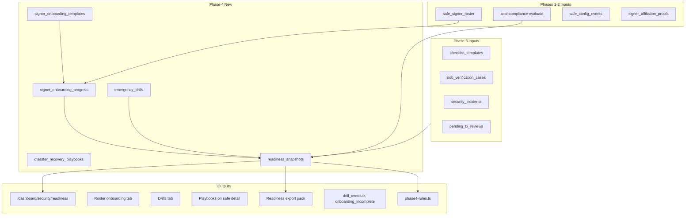

# SEAL Phase 4 — Readiness, Training & Drills (Implementation Plan)

This document is the detailed implementation plan for **Phase 4** of Convixa's [SEAL-aligned governance](SEAL_COMPLIANCE.md) roadmap.

| Phase | Question answered |
|-------|-------------------|
| Phase 1 | Is this Safe configured correctly? Did configuration change? |
| Phase 2 | Who operates each signer key? Are they verified for this Safe? |
| Phase 3 | Are we following correct procedures before signing? Are admin changes verified OOB? How do we report incidents? |
| **Phase 4** | **Is the organization *ready* for emergencies? Are signers trained, drills run, and playbooks maintained?** |

**Reference:** [SEAL Secure Multisig Best Practices](https://frameworks.securityalliance.org/wallet-security/secure-multisig-best-practices/) — *Training & Drills*, *Disaster Recovery Plan*, *Signer rotation documentation*, *Documented Procedures*.

**Read-only boundary (unchanged):** Convixa does not sign, execute, or remediate on-chain. Phase 4 tracks organizational readiness and documentation; signing and execution remain in Safe App.

---

## Executive summary

Phases 1–3 built **visibility**, **accountability**, and **operational workflow**. Phase 4 builds **organizational maturity**: repeatable onboarding, scheduled emergency drills, versioned disaster-recovery playbooks, and a single **readiness dashboard** that rolls up compliance across the org.

Phase 4 is the bridge between “we have SEAL features” and “we can prove operational readiness to auditors, boards, and security partners.”

### Phase 4 pillars

| Pillar | SEAL mapping | Convixa deliverable |
|--------|--------------|---------------------|
| **Signer onboarding** | Training checklist; hardware wallet; affiliation; comms | Per-org onboarding templates + per-roster progress |
| **Emergency drills** | Regular drills for emergency operations (pause, key loss, etc.) | Drill scheduler, run records, overdue alerts |
| **Disaster recovery playbooks** | Documented DR for compromise, UI down, lost keys, malicious tx | Versioned markdown playbooks per safe classification |
| **Readiness dashboard** | Holistic operational posture | Org-wide KPIs + drill calendar + export pack |

### Estimated effort

| Sprint | Duration | Focus |
|--------|----------|-------|
| 4.0 | 1 week | Schema, repos, org settings, doc scaffolding |
| 4.1 | 1.5 weeks | Signer onboarding templates + roster progress UI |
| 4.2 | 1.5 weeks | Drill scheduler + records + alerts |
| 4.3 | 1 week | DR playbooks (safe + org level) |
| 4.4 | 1 week | Readiness dashboard + compliance rules + exports |
| 4.5 | 0.5 week | Hardening, tests, docs, Phase 3 gap fixes |

**Total:** ~6–7 weeks (one engineer, full-time). Parallelizable across 2 engineers → ~4 weeks.

---

## Prerequisites (Phase 3 completion gaps to close in 4.0)

Before or during Phase 4, close these Phase 3 gaps so readiness metrics are trustworthy:

| Gap | Why it blocks Phase 4 | Fix in 4.0 |
|-----|----------------------|------------|
| OOB case evidence/confirmation UI incomplete (detail panel read-only) | Drills reference OOB maturity; admins need to complete cases | Add evidence upload + confirmation POST UI on OOB cases |
| Signer rotation export (planned in Phase 3 §3.4) not shipped | Readiness pack needs rotation history | `GET /api/org/signer-rotation-export` from `safe_config_events` |
| Pending tx matrix uses current-nonce only | Readiness “pending exposure” undercounts | Align matrix with signer-queue semantics or document explicitly |
| `countPendingTxsWithoutReview` same nonce filter | Compliance rule under-reports on multi-nonce queues | Scan all pending txs for treasury safes |

These are **small** (3–5 days) and should land in Sprint 4.0.

---

## Architecture



**Design principles**

1. **Org-scoped templates, safe/roster-scoped progress** — same pattern as checklist templates.
2. **Immutable drill records** — completed drills append-only; edits create `drill_amendments` or new version row.
3. **Playbooks versioned** — never overwrite; `version` + `published_at`; safe profile links `active_playbook_id`.
4. **Readiness is computed, not hand-edited** — nightly cron + on-demand refresh; store snapshot for trends.

---

## Deliverable 4.1 — Signer onboarding checklists

### SEAL mapping

- “All signers should complete training as outlined in the Implementation Checklist”
- Hardware wallet, affiliation message, dedicated signing profile
- Complements Phase 2 affiliation verification (Phase 4 tracks *onboarding completion*, not just crypto proof)

### Schema (`drizzle/0004_seal_phase4.sql`)

```sql
-- Org-level onboarding template (like checklist_templates)
signer_onboarding_templates (
  id, org_id, name, items_json, is_default, created_at, updated_at
)

-- Per (safe_id, signer_address) or per roster_id
signer_onboarding_progress (
  id, org_id, roster_id, safe_id, signer_address,
  template_id, items_state_json, status,  -- in_progress | completed
  completed_at, completed_by_user_id,
  created_at, updated_at
)
```

**Default template items (Convixa-seeded, org-editable):**

| Item ID | Label | Type | Auto rule |
|---------|-------|------|-----------|
| `hw_wallet_confirmed` | Hardware wallet used for this signer key | manual | — |
| `affiliation_signed` | Affiliation message signed for this Safe | auto | `affiliation_verified` |
| `operating_charter_read` | Read org multisig operating charter | manual | — |
| `comms_channel_joined` | Added to dedicated signer comms channel | manual | — |
| `testnet_drill_done` | Completed testnet signing drill | auto | `drill_completed` (type=testnet) |
| `oob_process_understood` | Understands OOB verification for admin changes | manual | — |

### Backend

| Module | Path |
|--------|------|
| Template seed + sync | `src/lib/readiness/onboarding-templates.ts` |
| Progress evaluator | `src/lib/readiness/evaluate-onboarding.ts` |
| Repository | `src/lib/db/repositories/readiness.repository.ts` |

**Auto rules (reuse patterns from `evaluate-items.ts`):**

- `affiliation_verified` — roster `verification_status === verified`
- `drill_completed` — exists completed drill for roster user in last 365d

### APIs

| Method | Route | Auth |
|--------|-------|------|
| GET | `/api/org/onboarding-templates` | `safes:read` |
| PATCH | `/api/org/onboarding-templates/[id]` | org admin |
| GET | `/api/safes/[id]/roster/[address]/onboarding` | safe access |
| POST | `/api/safes/[id]/roster/[address]/onboarding` | signer or admin |
| GET | `/api/org/onboarding-coverage` | `safes:read` |

### UI

1. **Security → Onboarding** (sub-tab) — org template editor (mirror Checklists page).
2. **Safe detail → Signer roster** — per-signer onboarding progress bar + checklist drawer.
3. **Security → Verification** — add “onboarding %” column alongside verification %.

### Compliance rules (`phase4-rules.ts`)

- `signer_onboarding_complete` — treasury/protocol: all active roster entries `completed` → pass; else warn/fail by %.
- `onboarding_template_configured` — org has ≥1 template.

### Alerts

- `onboarding_incomplete` — treasury safe has signer onboarded >30d ago without completion.
- Template in `policy-engine/templates.ts` for SEAL policy composer.

---

## Deliverable 4.2 — Emergency drill scheduler

### SEAL mapping

- “Teams should regularly conduct drills to ensure operational readiness and signer availability”
- Especially for `protocol_critical` safes and pause/emergency roles

### Schema

```sql
emergency_drill_schedules (
  id, org_id, safe_id nullable,  -- null = org-wide drill
  drill_type,  -- tabletop | testnet_sign | key_compromise_sim | pause_walkthrough | communications_failover
  cadence,     -- monthly | quarterly | semi_annual | annual | ad_hoc
  next_due_at, last_completed_at, owner_user_id,
  is_active, created_at, updated_at
)

emergency_drill_runs (
  id, schedule_id nullable, org_id, safe_id nullable,
  drill_type, title, scheduled_at, completed_at,
  status,  -- scheduled | completed | missed | cancelled
  participants_json,  -- [{ userId, rosterId?, role }]
  findings_json,      -- [{ severity, note, followUpDueAt }]
  notes, created_by_user_id, created_at
)
```

### Backend

| Module | Responsibility |
|--------|----------------|
| `src/lib/readiness/drill-scheduler.ts` | Compute `next_due_at`, mark missed after grace period |
| `src/lib/readiness/drill-types.ts` | Enum + SEAL labels |
| Cron | Extend `/api/cron/alerts-poll` or new `/api/cron/readiness-poll` |

**Default schedules (seeded for `protocol_critical` safes):**

- Quarterly `tabletop` — malicious pending tx response
- Annual `key_compromise_sim` — signer compromise playbook walkthrough
- Semi-annual `communications_failover` — OOB channel failure

### APIs

| Method | Route |
|--------|-------|
| GET/POST | `/api/org/drill-schedules` |
| PATCH | `/api/org/drill-schedules/[id]` |
| GET/POST | `/api/org/drill-runs` |
| PATCH | `/api/org/drill-runs/[id]` (complete, add findings) |
| GET | `/api/org/drill-runs-export?format=csv` |

### UI

**Security → Drills** (new sub-tab)

- Calendar/list view: upcoming, overdue, completed
- “Log drill” modal — date, participants (multi-select org members + roster), findings, notes
- Per-safe drill history on safe detail (collapsible card)

### Alerts

- `drill_overdue` — `next_due_at` + grace (7d) passed
- `drill_completed` — optional positive notification to security contact (audit only)

### Compliance rules

- `drill_completed_within_90d` — protocol_critical safes: completed drill in last 90 days
- `drill_schedule_exists` — protocol_critical has active schedule

---

## Deliverable 4.3 — Disaster recovery playbooks

### SEAL mapping

- “Establish a clear, documented process for signer compromise, UI down, lost keys, malicious proposals”
- “Maintain clear, secure, accessible documentation for emergency recovery”

### Schema

```sql
disaster_recovery_playbooks (
  id, org_id,
  scope,        -- org | safe
  safe_id nullable,
  classification,  -- treasury | protocol_critical | operational | null
  scenario,     -- signer_compromise | safe_ui_down | threshold_unreachable | malicious_pending_tx | lost_communications
  title, version, content_md,
  is_default, published_at, created_by_user_id,
  created_at, updated_at
)

-- Optional: link from safe profile
safes.active_playbook_set_id  -- FK to org playbook bundle
```

**Ship 5 Convixa default playbooks (markdown, org-customizable):**

1. Signer key compromise
2. Safe App / Transaction Service unavailable
3. Threshold unreachable (lost keys)
4. Malicious or suspicious pending transaction
5. Communication channel compromise

### Backend

- `src/lib/readiness/default-playbooks.ts` — seed content (Convixa-branded, SEAL-informed)
- `syncDefaultPlaybooks(orgId)` — insert-only sync (same pattern as checklist templates)
- Version bump on save: new row with `version + 1`, old row archived

### APIs

| Method | Route |
|--------|-------|
| GET | `/api/org/playbooks` |
| GET | `/api/org/playbooks/[id]` |
| POST | `/api/org/playbooks` (fork/custom) |
| PATCH | `/api/org/playbooks/[id]` (creates new version) |
| GET | `/api/safes/[id]/playbooks` (resolved by classification) |

### UI

1. **Security → Playbooks** — list by scenario, edit (admin), preview markdown
2. **Safe detail** — “Emergency playbooks” card with links to relevant scenarios + “last reviewed” date
3. **Incident modal** — link to open relevant playbook when reporting incident type

### Compliance rules

- `playbooks_published` — treasury/protocol org has all 5 default scenarios published
- `playbook_reviewed_within_365d` — warn if `published_at` > 12 months

---

## Deliverable 4.4 — Emergency readiness dashboard

### SEAL mapping

Holistic posture view for security leads and auditors.

### Route

`/dashboard/security/readiness` — new primary Security landing (optional redirect from signer-overlap).

### KPI tiles (computed)

| KPI | Source |
|-----|--------|
| Configuration compliance % | Phase 1 `evaluateCompliance` pass rate across inventory |
| Signer verification % | Phase 2 `verification-coverage` API |
| Onboarding completion % | Deliverable 4.1 |
| OOB case backlog | Phase 3 `countOpenOobCases` / overdue |
| Pending reviews gap | Phase 3 `pendingTxsWithoutReview` |
| Drill status | Overdue / due in 30d / last completed |
| Incident count (90d) | Phase 3 `security_incidents` |
| Mean time to first signature | Signer queue: `submissionDate` → first confirmation from linked wallet (new metric) |
| Quorum risk flags | Optional v1: safes where ≥2 signers unverified + overlap >60% |

### Backend

```typescript
// src/lib/readiness/compute-readiness.ts
export async function computeOrgReadiness(orgId: string): Promise<ReadinessSnapshot>

// Optional persistence for trends
readiness_snapshots (org_id, computed_at, metrics_json)
```

**Cron:** Weekly snapshot via `READINESS_SNAPSHOT_CRON` (or piggyback alerts-poll Sunday run).

### UI components

- `ReadinessScorecard` — traffic-light tiles
- `DrillCalendar` — upcoming drills
- `OnboardingCoverageChart` — by safe
- `ReadinessTrend` — 12-week sparklines from snapshots
- **Export readiness pack** button

### Export pack (`GET /api/org/readiness-export`)

ZIP or multi-sheet CSV:

1. Readiness summary (KPIs)
2. Per-safe compliance scorecard
3. Signer roster + verification + onboarding status
4. Drill history (12 months)
5. Playbook index (titles, versions, published dates)
6. Open OOB cases + incident log
7. Config change / rotation log (Phase 3.4 export)

Targets: board decks, SEAL reviewers, internal audit.

### Compliance rules (`phase4-rules.ts`)

Integrate into `evaluate.ts`:

- `readiness_drill_current`
- `readiness_onboarding_current`
- `readiness_playbooks_current`

Org-level rules (not per-safe) surfaced on readiness dashboard separately.

---

## Deliverable 4.5 — Permissions & RBAC

New permissions in `src/lib/permissions.ts`:

| Permission | Who | Use |
|------------|-----|-----|
| `readiness:read` | all members with `safes:read` | View dashboard, playbooks |
| `readiness:manage` | org admin, security role | Edit playbooks, templates, schedules |
| `drills:record` | org admin, team leads, designated drill owner | Log drill runs |
| `onboarding:manage` | signer (self), admin | Update own onboarding progress |

Default roles:

- **Admin/Owner:** all readiness permissions
- **Member:** `readiness:read`, `onboarding:manage` (self)
- **Custom security role:** `readiness:manage`, `drills:record`

---

## Deliverable 4.6 — Notifications & cron

### Env vars (add to `.env.example`)

```env
# Phase 4 readiness
READINESS_DRILL_GRACE_DAYS=7
READINESS_ONBOARDING_SLA_DAYS=30
READINESS_SNAPSHOT_ENABLED=true
# Optional: separate cron secret for readiness poll
```

### Cron tasks

| Task | Frequency | Endpoint |
|------|-----------|----------|
| Mark missed drills | Daily | `readiness-poll` |
| Fire `drill_overdue` alerts | Daily | existing alerts-poll |
| Fire `onboarding_incomplete` | Weekly | alerts-poll |
| Snapshot readiness metrics | Weekly | readiness-poll |

### Email templates

- Drill overdue (to schedule owner + security contact)
- Onboarding reminder (to linked user for roster entry)
- Quarterly readiness summary (optional, org admin)

Reuse Resend infrastructure from Phase 3 incidents.

---

## UI / navigation changes

Update `security-subnav.tsx`:

```
Pending reviews | OOB cases | Incidents | Readiness (new) | Drills | Onboarding | Playbooks | Checklists | ...
```

**Suggested default landing:** `/dashboard/security/readiness` (update `dashboard-nav.tsx` Security icon target).

### Safe detail additions

- **Roster tab:** onboarding progress chip
- **Emergency card:** playbook quick links + next drill due
- **Compliance scorecard:** Phase 4 rules appended

---

## Testing strategy

| Layer | Tests |
|-------|-------|
| Unit | `evaluate-onboarding.ts`, `drill-scheduler.ts`, `phase4-rules.test.ts`, `compute-readiness.test.ts` |
| Integration | Drill schedule → overdue → alert fires |
| API | Authz matrix for new routes |
| E2E (manual) | Complete onboarding → readiness % updates; log drill → compliance pass |

**Dev fixtures:**

- Seed drill schedule due yesterday → verify overdue alert
- Seed roster with verified affiliation but incomplete manual onboarding items

---

## Migration & rollout

1. `npm run db:generate` → `0004_seal_phase4.sql`
2. Deploy migration before app code (backward compatible — new tables only)
3. On first `GET /api/org/readiness`, run `syncDefaultPlaybooks` + `syncOnboardingTemplates`
4. Feature flag (optional): `READINESS_PHASE4_ENABLED=true` for staged rollout

### Backfill

- For each org with `safe_signer_roster` rows: create `signer_onboarding_progress` in `in_progress` with auto-completed items evaluated
- For each `protocol_critical` safe: seed quarterly drill schedule

---

## Phase 4 vs product roadmap (PROJECT_PROGRESS)

Phase 4 (SEAL) is **organizational readiness**. These related items are **adjacent** but scheduled separately:

| Feature | Relationship to Phase 4 | Recommendation |
|---------|-------------------------|----------------|
| Signer Coordination Layer (P1) | Feeds “mean time to first signature” KPI | Start in parallel after 4.4; shares signer queue data |
| Transaction Simulation (Tenderly) | Enhances pre-sign verification | Phase 5 or Phase 4.5 stretch |
| Audit Export / Chain of Custody | Readiness export is subset | Phase 5 §5.5 SEAL certification pack extends 4.4 export |
| Proposal Request Workflow | Separate product surface | Q4 2026 — not Phase 4 |

**Explicitly out of Phase 4 scope (→ Phase 5):**

- Timelock detection
- Testnet twin tracking
- Safe webhook real-time ingestion
- On-chain vs off-chain policy gap report

---

## Success criteria (definition of done)

Phase 4 is complete when:

1. Org admin can configure onboarding templates and see per-signer progress on every safe roster.
2. Org admin can schedule drills, log completions, and export drill history.
3. Default DR playbooks exist, are editable/versioned, and linked from safe detail + incidents.
4. `/dashboard/security/readiness` shows accurate KPIs from Phases 1–4 data sources.
5. At least 3 new alert types fire correctly (`drill_overdue`, `onboarding_incomplete`, optional `readiness_score_low`).
6. Phase 4 compliance rules appear on safe scorecards and readiness dashboard.
7. `docs/SEAL_COMPLIANCE.md`, `README.md`, `PROJECT_PROGRESS.md`, `src/lib/db/README.md` updated.
8. `npm run build` + `npm run lint` pass; unit tests for new rules and schedulers.

---

## Sprint breakdown (implementation order)

### Sprint 4.0 — Foundation (Week 1)

- [ ] Migration `0004_seal_phase4.sql` + Drizzle schema
- [ ] `readiness.repository.ts`
- [ ] Phase 3 gap fixes (rotation export, OOB evidence UI)
- [ ] `docs/SEAL_COMPLIANCE_PHASE4.md` linked from main roadmap
- [ ] Permissions scaffold

### Sprint 4.1 — Onboarding (Weeks 2–3)

- [ ] Default templates + sync
- [ ] Auto-evaluator (affiliation, drill cross-refs)
- [ ] APIs + roster UI
- [ ] Security → Onboarding tab
- [ ] `onboarding_incomplete` alert

### Sprint 4.2 — Drills (Weeks 3–4)

- [ ] Schedule + run schema and APIs
- [ ] Scheduler cron + missed drill detection
- [ ] Security → Drills UI
- [ ] `drill_overdue` alert + compliance rules

### Sprint 4.3 — Playbooks (Week 5)

- [ ] Default playbook content (5 scenarios)
- [ ] Versioned editor UI
- [ ] Safe detail emergency card
- [ ] Incident → playbook links

### Sprint 4.4 — Readiness dashboard (Week 6)

- [ ] `compute-readiness.ts` aggregator
- [ ] Readiness page UI + export pack
- [ ] Weekly snapshot cron
- [ ] Phase 4 rules in scorecard
- [ ] Nav updates

### Sprint 4.5 — Hardening (Week 7)

- [ ] Unit/integration tests
- [ ] Docs final pass
- [ ] Manual SEAL audit walkthrough with export pack
- [ ] Performance: readiness compute <3s for 50 safes

---

## Risk register

| Risk | Mitigation |
|------|------------|
| Readiness compute too slow (N+1 safe API calls) | Batch queries; cache in `readiness_snapshots`; compute incrementally |
| Drill fatigue (too many reminders) | Configurable cadence; single weekly digest email |
| Playbook content liability | Disclaimers in UI (“operational guidance, not legal advice”); org-owned edits |
| Onboarding busywork | Auto-complete items where Phase 2/3 already prove completion |
| Low adoption | Tie readiness KPIs to existing compliance scorecard visibility on inventory |

---

## Appendix A — File map (expected new files)

```
drizzle/0004_seal_phase4.sql
src/lib/db/schema/readiness.schema.ts
src/lib/db/repositories/readiness.repository.ts
src/lib/readiness/
  onboarding-templates.ts
  evaluate-onboarding.ts
  drill-scheduler.ts
  drill-types.ts
  default-playbooks.ts
  compute-readiness.ts
src/lib/seal-compliance/phase4-rules.ts
src/lib/seal-compliance/phase4-rules.test.ts
src/app/api/org/onboarding-templates/
src/app/api/org/drill-schedules/
src/app/api/org/drill-runs/
src/app/api/org/playbooks/
src/app/api/org/readiness-export/
src/app/api/cron/readiness-poll/
src/app/dashboard/security/readiness/
src/app/dashboard/security/drills/
src/app/dashboard/security/onboarding/
src/app/dashboard/security/playbooks/
```

---

## Appendix B — SEAL checklist crosswalk

| SEAL requirement | Phase 4 feature |
|------------------|-----------------|
| Training & drills | Drill scheduler + runs |
| Implementation checklist | Signer onboarding templates |
| Disaster recovery plan | DR playbooks |
| Signer rotation documentation | Rotation export (4.0) + readiness pack |
| Documented procedures | Playbooks + onboarding + readiness dashboard |
| Incident reporting | Phase 3 incidents linked to playbooks |

---

*Document version: 1.0 — June 2026. Update when implementation starts or scope changes.*
