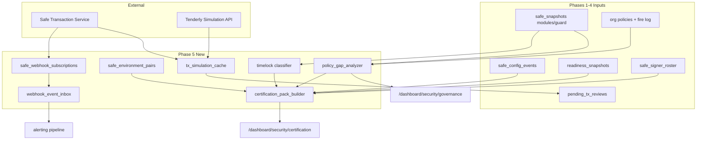

# SEAL Phase 5 — Advanced Governance, Real-Time Ops & Certification

**Status: Shipped (June 2026).** This document describes **Phase 5** of Convixa's [SEAL-aligned governance](SEAL_COMPLIANCE.md) roadmap — implementation plan plus shipped surface area.

| Phase | Question answered |
|-------|-------------------|
| Phase 1 | Is this Safe configured correctly? Did configuration change? |
| Phase 2 | Who operates each signer key? Are they verified for this Safe? |
| Phase 3 | Are we following correct procedures before signing? Are admin changes verified OOB? |
| Phase 4 | Is the org ready for emergencies? Are signers trained and drills current? |
| **Phase 5** | **Do we have defense-in-depth (timelocks, testnet practice, real-time monitoring)? Can we prove SEAL posture to auditors in one export?** |

**Reference:** [SEAL Secure Multisig Best Practices](https://frameworks.securityalliance.org/wallet-security/secure-multisig-best-practices/) — *Timelocks*, *Testnet practice*, *Active monitoring*, *Documented procedures*, *Pre-sign verification depth*.

**Read-only boundary (unchanged):** Convixa does not sign, execute, or remediate on-chain. Phase 5 **detects**, **simulates**, **ingests**, and **exports** — execution remains in Safe App.

---

## Executive summary

Phases 1–4 built configuration visibility, signer accountability, operational workflow, and organizational readiness. Phase 5 is the **maturity and assurance layer**: timelock awareness, testnet twin discipline, sub-minute event ingestion, transaction simulation before signing, on-chain/off-chain policy alignment, and a **SEAL certification pack** suitable for boards, auditors, and MiCA-style governance reviews.

Phase 5 answers: *“We don’t just follow SEAL in the app — we can prove it, simulate risk before signing, and catch events in real time.”*

### Phase 5 pillars

| Pillar | SEAL / product mapping | Convixa deliverable |
|--------|------------------------|---------------------|
| **5.1 Timelock & delay detection** | Execution delays for high-risk changes | Module classifier + delay metadata + compliance rules |
| **5.2 Testnet twin tracking** | Practice on testnet before mainnet ops | Paired safe links + drill/testnet drill correlation |
| **5.3 Safe webhook ingestion** | Active monitoring beyond polling | Verified webhook endpoint + event fan-in to alerts |
| **5.4 Policy gap report** | Off-chain policy vs on-chain guards | Gap matrix per safe (Convixa policies vs modules/guards) |
| **5.5 Transaction simulation** | Deep pre-sign verification | Tenderly (or fallback) simulation in signer queue + checklist auto-rules |
| **5.6 SEAL certification pack** | Auditor-ready documentation | Multi-sheet ZIP extending Phase 4 readiness export |
| **5.7 Governance dashboard** (optional) | Holistic advanced posture | `/dashboard/security/governance` rollup |

### Estimated effort

| Sprint | Duration | Focus |
|--------|----------|-------|
| 5.0 | 1 week | Schema, module/timelock classifier foundation, doc + env scaffolding |
| 5.1 | 1.5 weeks | Timelock detection + UI + compliance rules |
| 5.2 | 1 week | Testnet twin links + rules + UI on safe detail |
| 5.3 | 1.5 weeks | Webhook registration, ingestion, alert bridge |
| 5.4 | 1 week | Policy gap analyzer + Security hub report |
| 5.5 | 1.5 weeks | Simulation integration + checklist auto-rules |
| 5.6 | 1.5 weeks | Certification pack assembler + download UI |
| 5.7 | 0.5 week | Hardening, tests, docs, performance |

**Total:** ~9–10 weeks (one engineer). With 2 engineers (webhooks + simulation in parallel): ~6 weeks.

---

## Prerequisites (close before or during 5.0)

| Gap | Source | Fix in 5.0 |
|-----|--------|------------|
| Pending tx matrix / review counts use current-nonce filter only | Phase 3/4 | Scan all pending txs for strict safes (or document + fix) |
| `balance_change_*` alert types not evaluated | PROJECT_PROGRESS | Implement or exclude from certification pack scope |
| Readiness export is CSV-only | Phase 4 | Phase 5.6 adds structured ZIP + JSON manifest |
| No `certification:export` permission | RBAC | Add permission; gate pack download |
| Policy fire log not in exports | Compliance | Include `policy_fire_logs` in certification pack |

---

## Architecture



**Design principles**

1. **Detection over execution** — timelocks and twins are metadata + compliance, not deployment.
2. **Webhooks augment, not replace polling** — cron poller remains fallback; webhooks reduce latency for `protocol_critical` safes.
3. **Simulation is cached** — store simulation hash keyed by `(safeId, safeTxHash, blockNumber)` to control API cost.
4. **Certification pack is deterministic** — same inputs → reproducible export manifest with `exportedAt` + schema version.
5. **Reuse RBAC** — `security:read` for reports; `security:manage` for webhook/twin configuration; new `certification:export` for full pack (optional split).

---

## Deliverable 5.1 — Timelock & execution delay detection

### SEAL mapping

- High-value and protocol-critical safes should use **execution delays** for owner/threshold/module changes.
- SEAL discourages instant execution of sensitive governance actions without review windows.

### Scope

Detect and surface **delay mechanisms** attached to a Safe:

| Source | Detection approach |
|--------|-------------------|
| **Zodiac Delay** module | Known module mastercopy / interface fingerprints in `modules_json` |
| **Safe Timelock module** (custom) | Module address + optional `getThreshold`/`getTxNonce` style probes (read-only RPC) |
| **Roles / Hats gates** | Existing `safes` type hints (`roles_v2`, `hats_signer_gate`) + module metadata |
| **Pending tx ETA** | If module exposes `txCooldown` / `txExpiration` in decoded admin txs (future) |

### Schema (`drizzle/0005_seal_phase5.sql`)

```sql
safe_delay_attachments (
  id, org_id, safe_id,
  attachment_type,  -- zodiac_delay | timelock_module | guard_delay | unknown
  module_address,
  delay_seconds nullable,
  metadata_json,
  detected_at, last_verified_at,
  source  -- snapshot | rpc_probe | manual
)

-- Optional: org-level expected delay policy
org_governance_settings (
  org_id PK,
  min_delay_seconds_treasury,
  min_delay_seconds_protocol,
  require_timelock_protocol_critical boolean,
  updated_at
)
```

### Backend

| Module | Path |
|--------|------|
| Module fingerprint registry | `src/lib/governance-delay/module-registry.ts` |
| Classifier (runs on snapshot refresh) | `src/lib/governance-delay/classify-delays.ts` |
| Repository | `src/lib/db/repositories/governance-delay.repository.ts` |
| Integrate into refresh + poller | extend `safe-api` security attachments fetch |

**On snapshot refresh:**

1. Parse `modules_json` from Safe API.
2. Match against registry (Zodiac Delay, etc.).
3. Upsert `safe_delay_attachments`.
4. Emit `safe_config_events` subtype `DELAY_ATTACHMENT_DETECTED` when new/changed.

### APIs

| Method | Route | Auth |
|--------|-------|------|
| GET | `/api/safes/[id]/delay-attachments` | safe access |
| GET | `/api/org/delay-coverage` | `security:read` |
| PATCH | `/api/org/governance-settings` | `security:manage` |

### UI

- **Safe detail** — “Execution delays” card: module type, delay duration, last verified.
- **Security → Governance** — org table: safes missing required delay for classification.
- **Inventory** — badge: `⏱ Delay` / `⚠ No delay` for treasury/protocol.

### Compliance rules (`phase5-rules.ts`)

| Rule ID | Logic |
|---------|-------|
| `timelock_present` | `protocol_critical` → delay attachment OR documented exception |
| `timelock_delay_adequate` | delay ≥ org `min_delay_seconds_*` |
| `timelock_verified_recently` | `last_verified_at` within 30d |

### Alerts

- `timelock_removed` — delay module disappeared from snapshot diff.
- `timelock_delay_below_policy` — detected delay < org minimum.

---

## Deliverable 5.2 — Testnet twin tracking

### SEAL mapping

- Practice configuration changes and signing workflows on **testnet** before mainnet.
- Phase 4 drills include `testnet_sign` — Phase 5 links drills to **concrete twin safes**.

### Schema

```sql
safe_environment_pairs (
  id, org_id,
  production_safe_id,   -- FK safes (mainnet)
  twin_safe_id,         -- FK safes (sepolia etc.)
  twin_network,         -- sepolia | holesky | ...
  purpose,              -- staging | drill | upgrade_rehearsal
  linked_by_user_id,
  last_drill_at nullable,
  created_at, updated_at,
  UNIQUE(production_safe_id, twin_safe_id)
)
```

### Backend

| Module | Responsibility |
|--------|----------------|
| `src/lib/testnet-twins/validate-pair.ts` | Same threshold/owner count check (warn on drift) |
| `src/lib/testnet-twins/sync-status.ts` | Compare owners/threshold via snapshots |
| Repository | `src/lib/db/repositories/testnet-twins.repository.ts` |

**Auto-rules (onboarding / drills):**

- Extend `evaluate-onboarding.ts`: `drill_completed_testnet` → true if drill logged **and** twin pair exists **or** drill references twin safe.

### APIs

| Method | Route |
|--------|-------|
| GET/POST | `/api/org/testnet-twins` |
| DELETE | `/api/org/testnet-twins/[id]` |
| GET | `/api/safes/[id]/testnet-twin` |
| POST | `/api/safes/[id]/testnet-twin` (link existing inventory safe or suggest add) |

### UI

- **Safe detail (mainnet)** — “Testnet twin” card: link, drift status (owners/threshold), last drill.
- **Security → Governance** — twins coverage % for treasury/protocol.
- **Drills UI** — optional `twinSafeId` when logging `testnet_sign` drill.

### Compliance rules

| Rule ID | Logic |
|---------|-------|
| `testnet_twin_configured` | treasury/protocol has ≥1 twin |
| `testnet_twin_in_sync` | owners count + threshold match (warn on drift) |
| `testnet_drill_on_twin_90d` | completed testnet drill referencing twin in 90d |

---

## Deliverable 5.3 — Safe Transaction Service webhook ingestion

### SEAL mapping

- **Active monitoring** — detect pending txs and config-relevant events quickly, not only on 15s poll.

### Scope

Per-org (or per-safe) registration of Safe Transaction Service **webhooks** where supported, with:

1. Inbound endpoint: `POST /api/webhooks/safe-tx-service`
2. Signature / secret verification (per Safe docs)
3. Normalization to internal event types
4. Fan-in to existing alert evaluation (reuse poller handlers where possible)

### Schema

```sql
safe_webhook_subscriptions (
  id, org_id, safe_id nullable,
  network, safe_address,
  webhook_id_external,   -- ID returned by Safe API
  secret_hash,
  event_types_json,        -- ["INCOMING_TRANSACTION", "CONFIRMATION", ...]
  status,                  -- active | paused | error
  last_received_at,
  created_at, updated_at
)

webhook_event_inbox (
  id, org_id, subscription_id nullable,
  event_type, payload_json,
  safe_address, safe_tx_hash nullable,
  processed_at nullable,
  processing_error nullable,
  received_at
)
```

### Backend

| Module | Path |
|--------|------|
| Safe webhook API client | `src/lib/safe-webhooks/client.ts` |
| Register / unregister | `src/lib/safe-webhooks/lifecycle.ts` |
| Verify + parse | `src/lib/safe-webhooks/verify.ts` |
| Processor | `src/lib/safe-webhooks/process-event.ts` |
| Cron fallback | extend `/api/cron/alerts-poll` to process unprocessed inbox rows |

### Event → action mapping

| Webhook event | Convixa action |
|---------------|----------------|
| New pending multisig tx | Refresh signer queue cache; evaluate `pending_tx` alerts + policies |
| Confirmation added | Update pending counts; signer coordination metrics (future) |
| Execution | Insert/update `safe_config_events` if governance; refresh snapshot |
| Module enabled | `MODULE_CHANGE` config event + critical alert |

### APIs

| Method | Route | Auth |
|--------|-------|------|
| GET/POST | `/api/org/safe-webhooks` | `security:manage` |
| DELETE | `/api/org/safe-webhooks/[id]` | `security:manage` |
| POST | `/api/webhooks/safe-tx-service` | HMAC / shared secret (no session) |

### UI

**Security → Governance → Real-time monitoring**

- List subscriptions per safe
- “Enable webhooks” toggle for `protocol_critical` safes
- Last event received, error state
- Manual “replay” for failed inbox rows (admin)

### Env vars (`.env.example`)

```env
# Safe Transaction Service webhooks (Phase 5)
# SAFE_WEBHOOK_BASE_URL=https://your-convixa-host.com/api/webhooks/safe-tx-service
# SAFE_WEBHOOK_SIGNING_SECRET=...  # if required by deployment mode
```

### Alerts

- `webhook_subscription_error` — registration failed or 24h without events on active sub
- Faster firing of existing types (`pending_tx_unreviewed`, `config_change_critical`) due to lower latency

---

## Deliverable 5.4 — On-chain vs off-chain policy gap report

### SEAL mapping

- Documented procedures (Convixa policies, checklists, blocklists) should **align** with on-chain guards/modules where used.

### Scope

Per safe, produce a **gap matrix**:

| Off-chain (Convixa) | On-chain (detected) | Gap |
|---------------------|---------------------|-----|
| Blocklist policy active | No guard / module enforcing | ⚠ Gap |
| Max USD policy $50k | Zodiac guard with $100k limit | ⚠ Mismatch |
| Pre-sign checklist required | N/A (off-chain only) | ℹ Expected |
| Timelock required | No delay module | ❌ Critical gap |

### Backend

`src/lib/policy-gap/analyze.ts`

**Inputs:**

- Active org policies (`policies` table) + recent `policy_fire_logs`
- `orgBlacklistedAddresses`, address lists
- `safe_delay_attachments` (5.1)
- `modules_json`, `guard_address` from snapshot
- Safe classification + compliance scorecard failures

**Output:** `PolicyGapReport` per safe + org rollup.

### APIs

| Method | Route |
|--------|-------|
| GET | `/api/org/policy-gap` |
| GET | `/api/safes/[id]/policy-gap` |
| GET | `/api/org/policy-gap-export?format=csv` |

### UI

- **Security → Governance** — gap table with severity chips
- **Safe detail** — “Policy alignment” collapsible section
- Link gaps to remediation docs (playbooks Phase 4)

### Compliance rules

| Rule ID | Logic |
|---------|-------|
| `policy_gap_critical` | ≥1 critical gap on treasury/protocol |
| `policy_gap_reviewed` | no unreviewed gaps >30d (ack workflow optional) |

---

## Deliverable 5.5 — Transaction simulation (pre-sign depth)

### SEAL mapping

- **Pre-sign verification** — understand balance deltas, calldata, and risk **before** signing.

### Integration options

| Provider | Pros | Cons |
|----------|------|------|
| **Tenderly** (recommended) | Rich deltas, ABI decode, widely used | API key, per-sim cost |
| **Alchemy/Infura trace** | Single vendor | Less UX-ready |
| **Local eth_call batch** | No third party | Limited decoding |

**Recommendation:** Tenderly Simulation API v2 with org-level API key in env.

### Schema

```sql
tx_simulation_cache (
  id, org_id, safe_id, safe_tx_hash,
  network, block_number,
  provider,               -- tenderly
  status,                 -- success | failed | skipped
  result_json,            -- balance diffs, decoded call, gas, alerts
  simulated_at,
  expires_at,
  UNIQUE(safe_id, safe_tx_hash, block_number)
)
```

### Backend

| Module | Path |
|--------|------|
| Tenderly client | `src/lib/tx-simulation/tenderly-client.ts` |
| Risk flags | `src/lib/tx-simulation/risk-flags.ts` |
| Orchestrator | `src/lib/tx-simulation/simulate-pending-tx.ts` |

**Checklist auto-rules (extend Phase 3):**

| Auto rule | Source |
|-----------|--------|
| `simulation_clean` | no critical risk flags |
| `simulation_balance_expected` | delta matches declared amount |
| `destination_matches_simulation` | `to` matches simulated target |

### APIs

| Method | Route |
|--------|-------|
| POST | `/api/safes/[id]/pending/[safeTxHash]/simulate` |
| GET | `/api/safes/[id]/pending/[safeTxHash]/simulate` |

### UI

- **Signer queue** — “Simulate” button + expandable result panel (deltas, decoded call, flags)
- **Safe detail pending tx** — same component
- **Checklist panel** — auto-items turn green when simulation passes

### Env

```env
# TENDERLY_ACCESS_KEY=
# TENDERLY_ACCOUNT_SLUG=
# TENDERLY_PROJECT_SLUG=
# TX_SIMULATION_ENABLED=true
# TX_SIMULATION_CACHE_TTL_HOURS=24
```

### Compliance rules

| Rule ID | Logic |
|---------|-------|
| `simulation_run_before_sign` | strict safes: pending txs older than SLA have simulation cache |
| `simulation_no_critical_flags` | warn if critical flags on pending txs awaiting signature |

---

## Deliverable 5.6 — SEAL certification export pack

### SEAL mapping

- Single **auditor-ready artifact** proving Phases 1–5 posture (extends Phase 4 readiness export).

### Scope

`GET /api/org/seal-certification-export` → ZIP containing:

| # | File | Contents |
|---|------|----------|
| 1 | `manifest.json` | Schema version, org, export time, included safes, SEAL phase coverage |
| 2 | `readiness_summary.json` | Phase 4 `computeOrgReadiness` output |
| 3 | `compliance_scorecards.csv` | Per-safe pass/warn/fail counts + rule IDs |
| 4 | `signer_roster.csv` | Phase 2 export |
| 5 | `signer_verification.csv` | Coverage + affiliation status |
| 6 | `onboarding_progress.csv` | Phase 4 |
| 7 | `drill_history.csv` | Phase 4 |
| 8 | `playbooks_index.csv` | Titles, versions, published dates |
| 9 | `config_change_log.csv` | `safe_config_events` |
| 10 | `signer_rotation.csv` | Phase 4 rotation export |
| 11 | `oob_cases.csv` | Phase 3 |
| 12 | `pending_reviews.csv` | Phase 3 |
| 13 | `incidents.csv` | Phase 3 |
| 14 | `policy_gap.csv` | Phase 5.4 |
| 15 | `delay_attachments.csv` | Phase 5.1 |
| 16 | `testnet_twins.csv` | Phase 5.2 |
| 17 | `policy_fire_log.csv` | Convixa policy evaluations |
| 18 | `audit_log_excerpt.csv` | Security-relevant audit rows (90d) |
| 19 | `seal_checklist_mapping.csv` | SEAL requirement → evidence file row |

Optional **PDF summary** (stretch): 2-page executive summary with readiness score + top gaps.

### Backend

`src/lib/certification/build-pack.ts`

- Orchestrates existing exporters (readiness, roster, rotation, etc.)
- Adds new Phase 5 slices
- Streams ZIP (avoid loading all into memory for large orgs)

### UI

**Security → Certification** (new sub-tab)

- “Generate SEAL certification pack” button
- Last export timestamp + download link (if stored in `certification_exports` table — optional)
- Checklist preview: which sections are ✅ / ⚠ before download

### Schema (optional persistence)

```sql
certification_exports (
  id, org_id, exported_by_user_id,
  manifest_json, storage_key nullable,  -- S3/local path if retained
  created_at
)
```

### Permissions

| Permission | Use |
|------------|-----|
| `security:read` | Preview checklist |
| `certification:export` | Download full pack (new) |

Seed **Security Lead** role with `certification:export`; Signer role without it.

### Compliance

Org-level metric (not per-safe): `certification_pack_current` — exported within 90d (warn).

---

## Deliverable 5.7 — Governance dashboard (rollup UI)

### Route

`/dashboard/security/governance` — advanced posture landing (optional redirect from readiness for security leads).

### KPI tiles

| KPI | Source |
|-----|--------|
| Timelock coverage % | 5.1 |
| Testnet twin coverage % | 5.2 |
| Webhook health | 5.3 |
| Critical policy gaps | 5.4 |
| Pending txs without simulation | 5.5 |
| Days since last certification export | 5.6 |
| Readiness score (Phase 4) | existing |

### Components

- `GovernanceScorecard`
- `PolicyGapTable` (top 10)
- `WebhookStatusList`
- `TwinDriftAlerts`

---

## Permissions & RBAC (extend Phase 4 matrix)

Add to `permissions.ts` + `permission-matrix.ts`:

| Permission | Matrix row | Column |
|------------|------------|--------|
| `certification:export` | Data Export | Create (or new row “Certification”) |
| `governance:manage` | Security Hub | Edit (webhooks, twins, governance settings) — *or fold into `security:manage`* |

Update default roles:

| Role | Phase 5 additions |
|------|-------------------|
| **Signer** | No change (`signer:workflow` only) |
| **Security Lead** | `certification:export`; inherits webhook/twin manage via `security:manage` |

---

## Testing strategy

| Layer | Tests |
|-------|-------|
| Unit | `classify-delays.test.ts`, `analyze-policy-gap.test.ts`, `risk-flags.test.ts`, `phase5-rules.test.ts`, `build-pack.test.ts` (manifest structure) |
| Integration | Webhook verify + inbox processing; simulation cache hit/miss |
| Fixtures | Safe with Zodiac Delay module JSON; twin pair drift; policy/on-chain mismatch |
| Manual | Full certification ZIP walkthrough against SEAL checklist |

---

## Migration & rollout

1. `npm run db:generate` → `0005_seal_phase5.sql`
2. Deploy migration before app code
3. Feature flags:
   - `GOVERNANCE_PHASE5_ENABLED=true`
   - `TX_SIMULATION_ENABLED=false` until Tenderly configured
   - `SAFE_WEBHOOKS_ENABLED=false` until public URL configured
4. Backfill: run delay classifier on all safes on first cron after deploy
5. Existing orgs: no twins/webhooks until configured (compliance rules warn, not fail)

---

## Phase 5 vs product roadmap

| Product feature | Phase 5 relationship |
|-----------------|----------------------|
| **Signer Coordination Layer** (P1) | Webhooks + simulation feed coordination metrics; not required for 5.0 MVP |
| **Proposal Request Workflow** | Certification pack reserves slot for request/approval log (empty until built) |
| **Portfolio Dashboard** | Out of scope |
| **Audit Export / MiCA** | Phase 5.6 is the SEAL-focused subset; full FASB pack adds categorization (separate) |
| **Safe Deployment Wizard** | Out of scope; twins link to wizard later |

---

## Success criteria (definition of done)

Phase 5 is complete when:

1. Treasury/protocol safes show timelock/delay attachments (or documented exceptions) on safe detail.
2. Org can link mainnet safes to testnet twins and see drift warnings.
3. Webhooks can be enabled for at least one safe; events flow to alerts within 60s.
4. Policy gap report runs per org and per safe with CSV export.
5. Signer queue can simulate a pending tx (when Tenderly configured) and checklist auto-rules reflect results.
6. SEAL certification pack downloads as structured JSON (19 sections + `manifest.json`; CSV summary also available).
7. Phase 5 compliance rules appear on scorecards + governance dashboard.
8. Docs updated: `SEAL_COMPLIANCE.md`, `README.md`, `PROJECT_PROGRESS.md`, `src/lib/db/README.md`, `.env.example`.
9. `npm run build` + `npm run lint` pass; unit tests for classifiers and pack builder.

---

## Sprint breakdown (implementation order)

### Sprint 5.0 — Foundation (Week 1)

- [ ] Migration `0005_seal_phase5.sql` + schemas
- [ ] `governance-delay.repository.ts`, `testnet-twins.repository.ts` stubs
- [ ] `phase5-rules.ts` scaffold in `evaluate.ts`
- [ ] Permissions: `certification:export`
- [ ] Fix pending-tx review nonce scope (prerequisite)
- [ ] Link doc from `SEAL_COMPLIANCE.md`

### Sprint 5.1 — Timelocks (Weeks 2–3)

- [ ] Module registry + classifier on snapshot refresh
- [ ] Safe detail + inventory badges
- [ ] `timelock_*` alerts + compliance rules

### Sprint 5.2 — Testnet twins (Week 3–4)

- [ ] Pair CRUD APIs + UI
- [ ] Drift detection + drill linkage
- [ ] Compliance rules

### Sprint 5.3 — Webhooks (Weeks 4–5)

- [ ] Safe API webhook client + subscription CRUD
- [ ] Inbound route + verify + inbox processor
- [ ] Governance UI for webhook health

### Sprint 5.4 — Policy gap (Week 6)

- [ ] `analyze-policy-gap.ts`
- [ ] Governance dashboard gap table
- [ ] Export slice for certification pack

### Sprint 5.5 — Simulation (Weeks 6–7)

- [ ] Tenderly client + cache
- [ ] Signer queue UI + checklist auto-rules
- [ ] Compliance rules

### Sprint 5.6 — Certification pack (Weeks 8–9)

- [ ] `build-pack.ts` ZIP assembler
- [ ] Security → Certification UI
- [ ] `seal_checklist_mapping.csv` generator

### Sprint 5.7 — Hardening (Week 10)

- [ ] Tests, performance (pack <30s for 50 safes)
- [ ] Docs final pass
- [ ] Manual SEAL reviewer dry-run

---

## Risk register

| Risk | Mitigation |
|------|------------|
| Safe webhook API varies by chain | Start with eth/sepolia; feature-flag per network |
| Tenderly cost at scale | Cache aggressively; simulate on-demand not on every poll |
| False positive timelock detection | Human “acknowledge exception” on safe profile |
| Certification pack size | Per-safe filters; max row limits with manifest notes |
| Twin drift noise | Warn only; don’t fail compliance on minor owner ordering |
| Webhook replay attacks | HMAC verification + idempotency keys in inbox |

---

## Appendix A — Expected new files

```
drizzle/0005_seal_phase5.sql
src/lib/db/schema/governance-advanced.schema.ts
src/lib/db/repositories/governance-delay.repository.ts
src/lib/db/repositories/testnet-twins.repository.ts
src/lib/db/repositories/safe-webhooks.repository.ts
src/lib/governance-delay/
src/lib/testnet-twins/
src/lib/safe-webhooks/
src/lib/policy-gap/
src/lib/tx-simulation/
src/lib/certification/
src/lib/seal-compliance/phase5-rules.ts
src/app/api/webhooks/safe-tx-service/
src/app/api/org/safe-webhooks/
src/app/api/org/testnet-twins/
src/app/api/org/policy-gap/
src/app/api/org/seal-certification-export/
src/app/api/safes/[id]/pending/[safeTxHash]/simulate/
src/app/dashboard/security/governance/
src/app/dashboard/security/certification/
```

---

## Appendix B — SEAL checklist crosswalk (Phase 5)

| SEAL requirement | Phase 5 feature |
|------------------|-----------------|
| Timelocks / delays | 5.1 delay detection + rules |
| Testnet practice | 5.2 twin tracking + drill linkage |
| Active monitoring | 5.3 webhooks |
| Pre-sign verification (depth) | 5.5 simulation |
| Documented procedures vs enforcement | 5.4 policy gap |
| Audit / board reporting | 5.6 certification pack |

---

*Document version: 1.0 — June 2026. Update when implementation starts or scope changes.*
